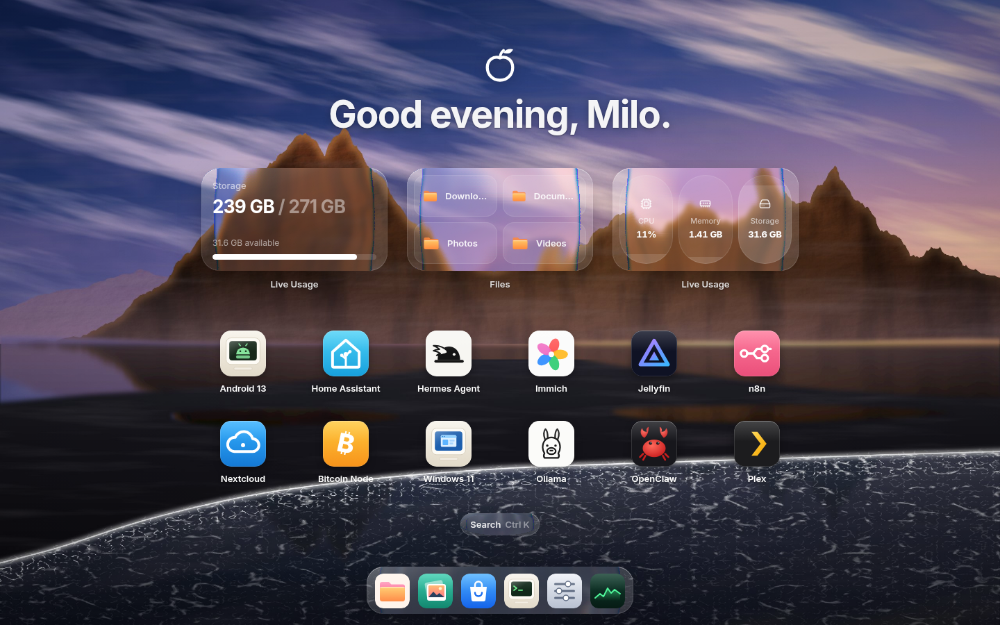

# Plumos

A beautiful home screen for your home server — glass widgets, your apps, and a
dock of built-in tools, all in the browser.



## Features

- **Home screen** with a time-aware greeting, live glass widgets and your apps
- **Liquid glass** panels that refract the wallpaper (Chromium), frosted glass elsewhere
- **Dock** with magnification, and **⌘K search** across apps, settings and the App Store
- **Built-in apps**: Files, Photos, App Store, Terminal, Settings, Live Usage and a virtual machine viewer
- **Real system stats** (CPU, temperature, memory, storage, network) from the machine it runs on —
  with realistic demo data when there's no server behind it

## Getting started

```bash
npm install
npm run dev          # http://localhost:5173
```

Run it on your server:

```bash
npm run build
PORT=80 npm start    # serves the app and /api on port 80
```

Set `PLUMOS_STORAGE_PATH` to the mount point of your data drive so the storage widgets
report the right disk.
